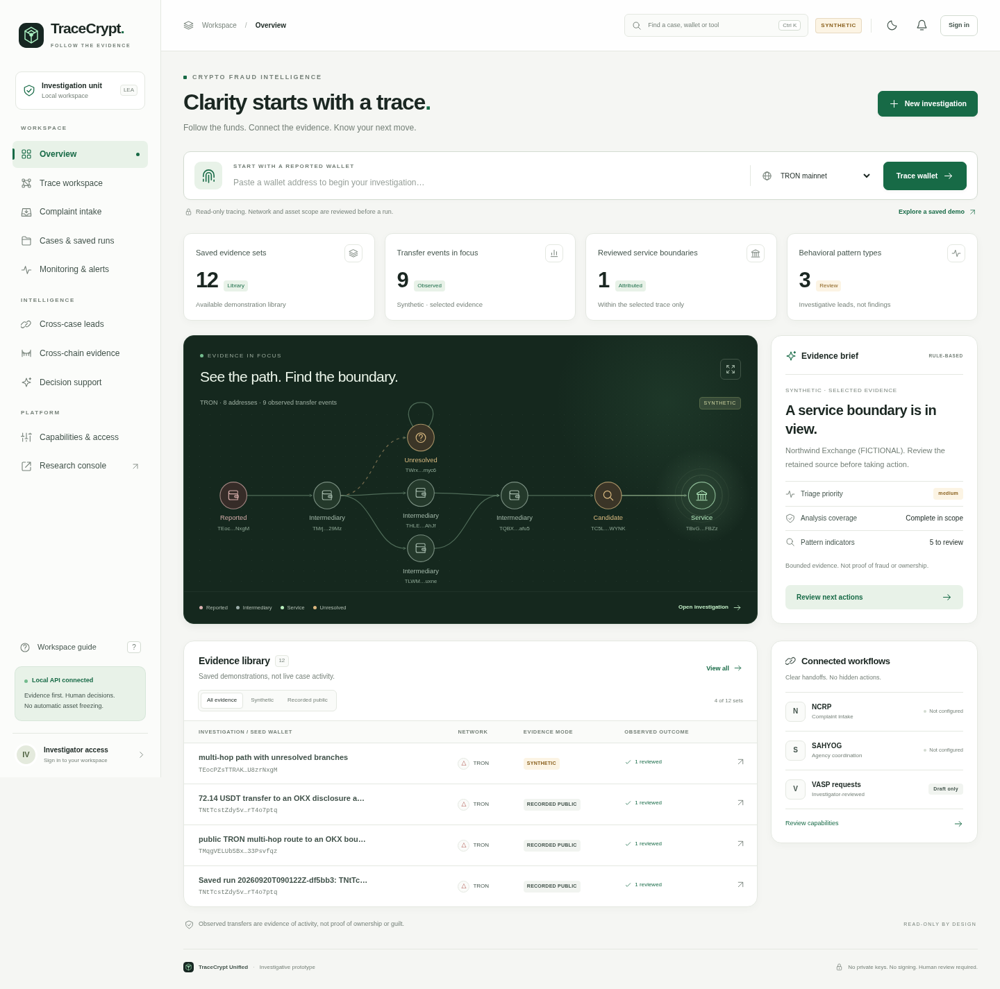
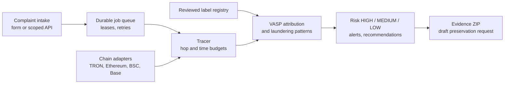
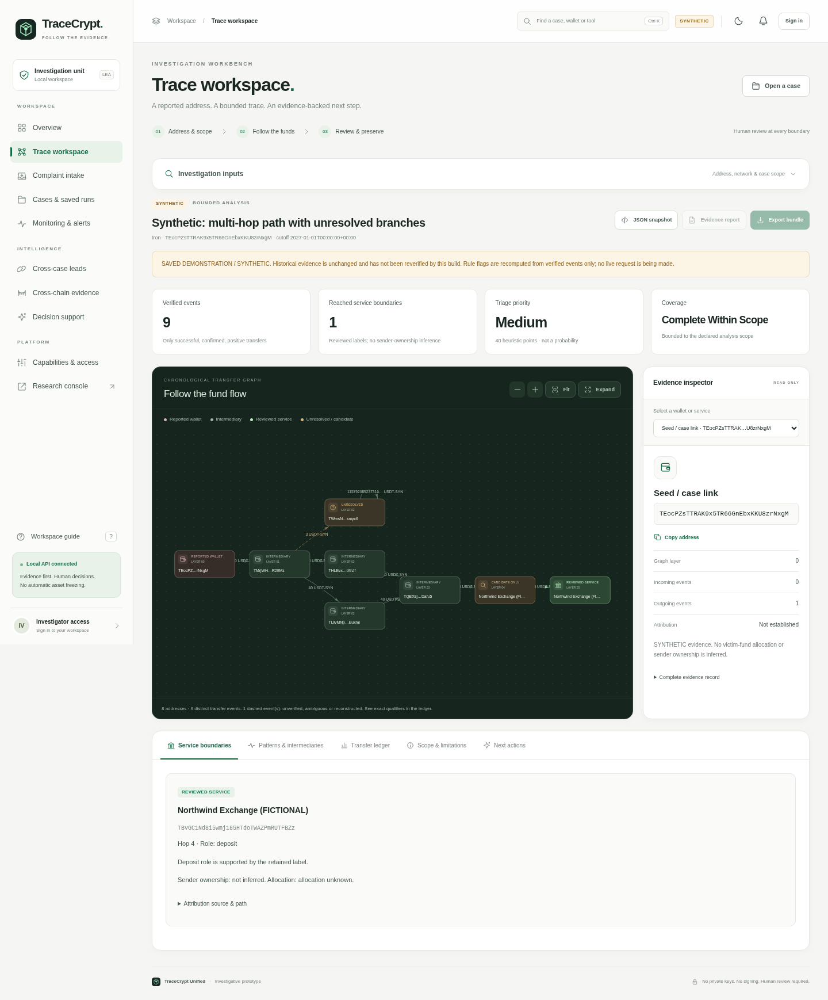
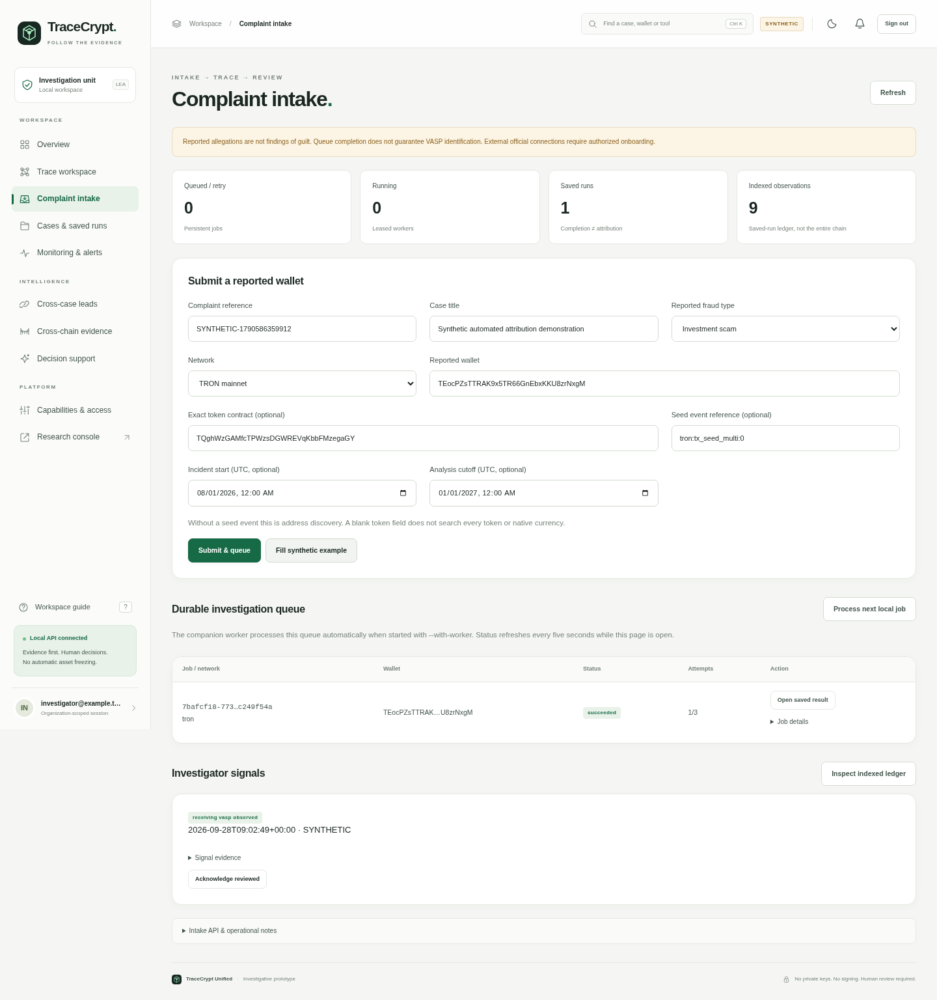
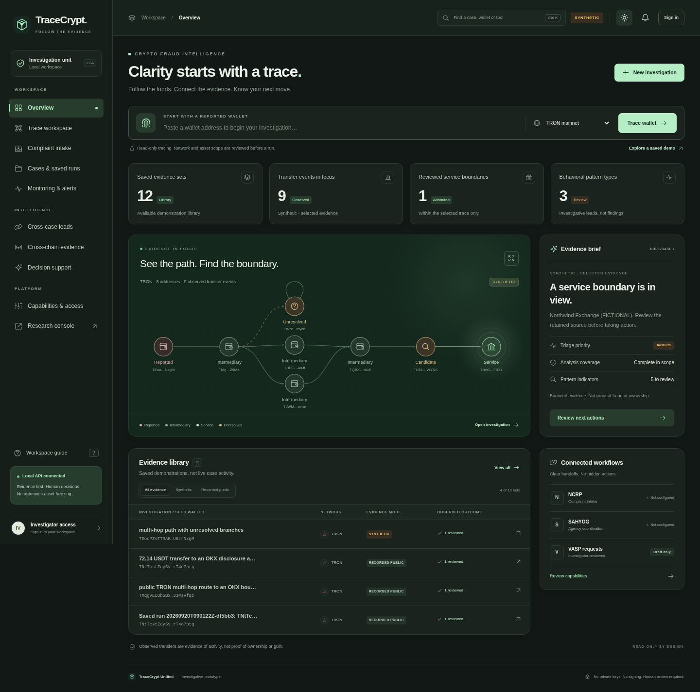
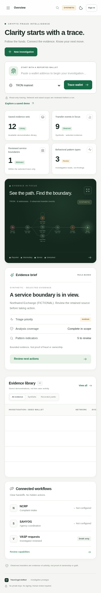

<div align="center">

# TraceCrypt

**Follow the evidence, from a victim-reported wallet to the exchange that received the funds.**

Real-time identification of fraud-linked cryptocurrency exchanges from victim-reported wallet addresses, using automated blockchain analytics.


Smart India Hackathon 2026 · Problem Statement **SIH26183** · Team **HACKTILLDAWN** (ID 170857)



</div>

---

## The problem

Victims of investment, task-based, sextortion, ransomware and phishing scams usually report a wallet that is a burner or layering wallet, not the exchange. Tracing the money by hand across chains, DeFi, mixers and bridges is slow, so freezing and recovery arrive too late.

## What TraceCrypt does

**Reported wallet → durable investigation job → verified chronological trace → nearest observed receiving VASP → investigator review, monitoring and evidence package.**



| | |
|---|---|
| **Automated VASP identification** | The nearest receiving exchange is ranked by verified hops and named only when a reviewed label backs it. |
| **Laundering-wallet detection** | Fan-in/out, peeling, rapid and repeated forwarding, and cycles flag intermediary wallets. |
| **Cross-chain aware** | TRON, Ethereum, BSC and Base, with checked Ethereum→Base USDC (CCTP V2) bridge movements. |
| **Action-ready** | Risk category, draft freeze/preservation request to the VASP, and a hash-verified evidence report. |
| **Optional ML** | IsolationForest graph-anomaly ranking on a held-out cohort. No fraud probabilities are produced. |

## Demo

- **[Watch the 5-minute walkthrough](docs/demo/tracecrypt-demo.mp4)** (1080p, captioned, synthetic data): complaint intake, automatic tracing, nearest VASP, laundering patterns, reports and export, wallet monitoring and alerts, cross-case and cross-chain evidence, ML risk ranking. The narration script is in [docs/demo/DEMO_SCRIPT.md](docs/demo/DEMO_SCRIPT.md).
- **[Prototype video on YouTube](https://youtu.be/2K8n6qzgyus)**

## Screenshots

<table>
  <tr>
    <td width="50%"><br><sub><b>Trace workspace</b> · interactive fund-flow graph with an evidence inspector</sub></td>
    <td width="50%"><br><sub><b>Complaint intake</b> · up to 20 wallets per complaint, queued automatically</sub></td>
  </tr>
  <tr>
    <td width="50%"><br><sub><b>Dark theme</b> · evidence-first overview</sub></td>
    <td width="50%" align="center"><br><sub><b>Mobile</b> · responsive layout</sub></td>
  </tr>
</table>

## Quick start

Use **Python 3.12 or 3.13**. Node.js is not needed for the supplied workspace.

```bash
# Linux / macOS
cd TraceCrypt_Unified
python3.12 -m venv .venv
.venv/bin/python -m pip install -r requirements-runtime.txt
.venv/bin/python launch.py --prepare --with-worker
```

```powershell
# Windows / PowerShell
cd TraceCrypt_Unified
py -3.12 -m venv .venv
.\.venv\Scripts\python.exe -m pip install -r requirements-runtime.txt
.\.venv\Scripts\python.exe launch.py --prepare --with-worker
```

Open **http://127.0.0.1:8010/workspace/** and sign in with the public demo credentials:

```text
Email:    investigator@example.test
Password: demo-password-change-me
```

Later starts: `python launch.py --with-worker`. Stop with Ctrl+C. The launcher refuses production mode, so keep the demo on localhost.

### Try the workflow in a minute

1. Open **Complaint intake**, click **Fill synthetic example**, then **Submit & queue**.
2. The worker picks the job up automatically and the dashboard refreshes every five seconds.
3. Open the finished run to inspect the graph, nearest observed VASP, exact transfers, evidence and limitations.
4. Export the evidence ZIP and reopen the run from **Cases & saved runs**.

The example uses a fictional exchange. It is not evidence about a real service or wallet owner.

<details>
<summary>Manual trace fixture and wallet monitoring</summary>

```text
Network:         tron
Reported wallet: TEocPZsTTRAK9x5TR66GnEbxKKU8zrNxgM
Token contract:  TQghWzGAMfcTPWzsDGWREVqKbbFMzegaGY
Seed event:      tron:tx_seed_multi:0
Incident start:  2026-08-01T00:00:00Z
Cutoff:          2027-01-01T00:00:00Z
```

Use **Monitoring & alerts** to watch this wallet/token from 2026-08-01 UTC. For unattended polling, run the server without `--with-worker` and start one worker separately:

```bash
python operations_worker.py --poll-watches --watch-interval 60
```

Use only one SQLite queue worker and one watch scheduler per local database.
</details>

## How fast is it

Measured on the SYNTHETIC demo case (18 events, 11 addresses, TRON), one local laptop, worker running, 20 complaints submitted through the intake API one after another:

| Step | Median | Range |
|---|---|---|
| Trace itself (job `duration_ms`) | 12 ms | 4 to 18 ms |
| Intake API accepts the complaint | 17 ms | up to 32 ms |
| Submit to finished result | about 3 s | 2.4 to 3.0 s |

Most of the 3 seconds is the queue worker's polling interval, not tracing. These figures come from an offline fixture. LIVE traces call TronGrid and EVM RPC providers, so they will take longer, and no LIVE latency has been measured yet.

## Architecture

| Layer | Choice | Why |
|---|---|---|
| Chain data | TronGrid + EVM RPC | Public data for TRON TRC20 and Ethereum/BSC/Base ERC20, with receipt and finality checks |
| API | FastAPI + SQLAlchemy, Alembic migrations | Typed REST API with auto OpenAPI docs |
| Store | SQLite (PostgreSQL claim path retained for scale-out) | Zero-ops cases, jobs, saved runs and indexed observations |
| Graph UI | vis-network | Zoom, focus and an evidence inspector |
| Bridges | Circle CCTP V2 | Nonce, domain, recipient and amount reconciliation |
| ML | scikit-learn IsolationForest | Ranks unusual graphs; no fraud probability |
| Reports | xhtml2pdf + SHA-256 | JSON/HTML/PDF/CSV with a checksum manifest |

## What's new in v2

| Capability | Delivered behavior |
|---|---|
| Complaint automation | Validated JSON intake and UI; organization-bound credentials; idempotent complaint references; persistent case/job creation. |
| Durable jobs | Leases, conditional claims, retries, expiry recovery, cancellation, fenced result saves. |
| VASP attribution | First accepted receiving service on each verified path, ranked by actual hops. Conflicting labels stay unresolved. Sender ownership is never inferred from payment. |
| Investigation intelligence | Evidence-linked fan-in/out, forwarding, peeling-like and cyclic indicators, plus authorized cross-case address overlaps. |
| Cross-chain evidence | Bounded Ethereum→Base USDC CCTP V2 checker with raw evidence export. |
| Evidence and workflow | Saved-run export, checksum manifest, linked bridge evidence, draft-only preservation requests. |

## Honest scope

TraceCrypt is a working **investigative prototype**. It is not an asset-freezing service, an official NCRP/SAHYOG connector or a universal exchange-ownership database.

- Synthetic examples, saved public captures and LIVE acquisition are kept separate.
- No private keys, no transaction signing, no automatic legal requests, no fabricated live results.
- Only two narrowly time-scoped historical OKX anchors are supplied as real accepted VASP labels, so new wallets may stay unresolved.
- Not implemented: native/internal transfers, Bitcoin, Solana, arbitrary swaps and bridges, privacy mechanisms.

| Implemented | Prototype | Planned |
|---|---|---|
| Intake, durable queue, tracing, nearest VASP, patterns, evidence ZIP | CCTP V2 checker, IsolationForest ranking, draft VASP requests | Live NCRP/SAHYOG link, Bitcoin and Solana, wider labels |

<details>
<summary>Configure genuine LIVE work</summary>

Use a **new database**, real operators, reviewed token metadata and reviewed labels. Never reuse the synthetic database for LIVE.

```dotenv
CFA_APP_ENV=dev
CFA_DATA_MODE=LIVE
CFA_ENGINE_VERSION=unified-2.0
CFA_SECRET_KEY=GENERATE_A_RANDOM_SECRET_NOT_THIS_PLACEHOLDER
CFA_DATABASE_URL=sqlite+pysqlite:///../var/live.db
CFA_LABEL_SOURCE=reviewed_sets
CFA_ETHEREUM_RPC_URL=YOUR_ETHEREUM_MAINNET_RPC
CFA_BSC_RPC_URL=YOUR_BSC_MAINNET_RPC
CFA_BASE_RPC_URL=YOUR_BASE_MAINNET_RPC
CFA_TRON_API_KEY=YOUR_TRONGRID_KEY
```

Put real values only in `api/.env`, then:

```bash
python launch.py --prepare-only
python manage.py create-operator --email investigator@your-agency.example --organization "Your unit" --slug your-unit
python manage.py register-token --network ethereum --contract YOUR_EXACT_CONTRACT --decimals YOUR_REVIEWED_DECIMALS --symbol YOUR_DISPLAY_SYMBOL --source "YOUR_REVIEWED_SOURCE" --verify-evm
```

RPC verification does not authenticate the token issuer. The CCTP route needs a LIVE case, Ethereum and Base RPC endpoints and registered Base USDC; it does not verify Circle attestation signatures.
</details>

## Documentation

- [Start the GUI](START_GUI.md) · [UI redesign notes](docs/ui-redesign/README.md)
- [Problem-statement coverage](docs/completion/PROBLEM_STATEMENT_COVERAGE.md)
- [Intake API and sample payload](docs/completion/API_INTEGRATION.md)
- [Deployment, security and boundaries](docs/completion/DEPLOYMENT_AND_SECURITY.md)
- [Validation results](docs/completion/TEST_RESULTS.md) · [Changelog](docs/completion/CHANGELOG-v2.md)
- [Full v2 README](docs/README-v2-detailed.md)

`schemas/` holds exported JSON/OpenAPI contracts, and the running API reference is at `/docs`. Run `python validation/run_checked_suite.py` for the documented offline subset. The full suite is `cd api && uv sync --group dev && uv run pytest`.

## Team

**HACKTILLDAWN** · SIH 2026 · Problem Statement SIH26183 (Blockchain and Cybersecurity, Software)

Repository: [github.com/Ashvinsai/tracecrypt](https://github.com/Ashvinsai/tracecrypt)
